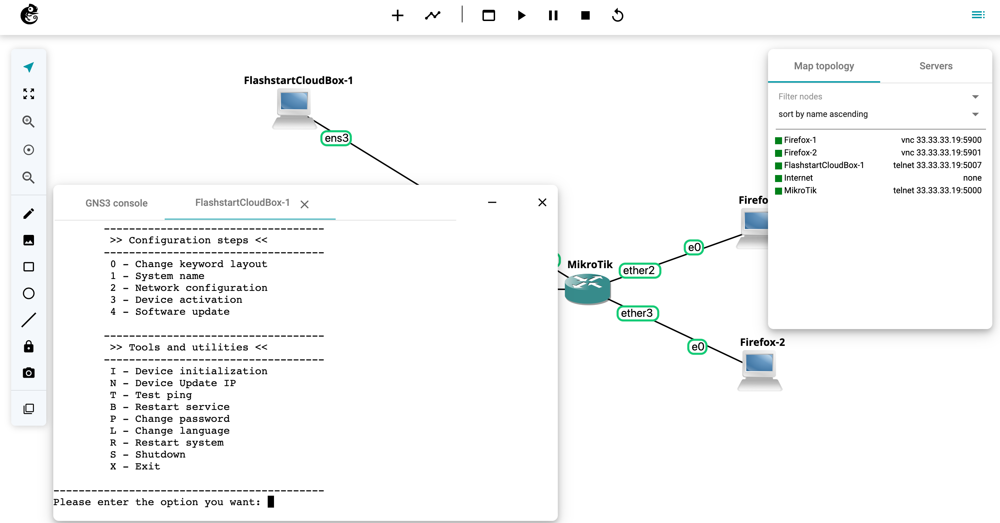

# Flashstart Cloud Box

See:

- [Pro+ Filter setup - Introduction](https://cloud.flashstart.com/customerarea/share.php?Lang=IT&mode=share&module=88115ed8e82c07b09bc00058e6fb827b&name=FAQ&code=1458)
- [DNS Proxy Setup](https://cloud.flashstart.com/customerarea/share.php?Lang=IT&mode=share&module=88115ed8e82c07b09bc00058e6fb827b&name=FAQ&code=1500)
- [DNS Proxy configuration](https://cloud.flashstart.com/customerarea/share.php?Lang=IT&mode=share&module=88115ed8e82c07b09bc00058e6fb827b&name=FAQ&code=1462)
- [DNS Proxy - Advanced Tools](https://cloud.flashstart.com/customerarea/support/?open_kb=1510)

